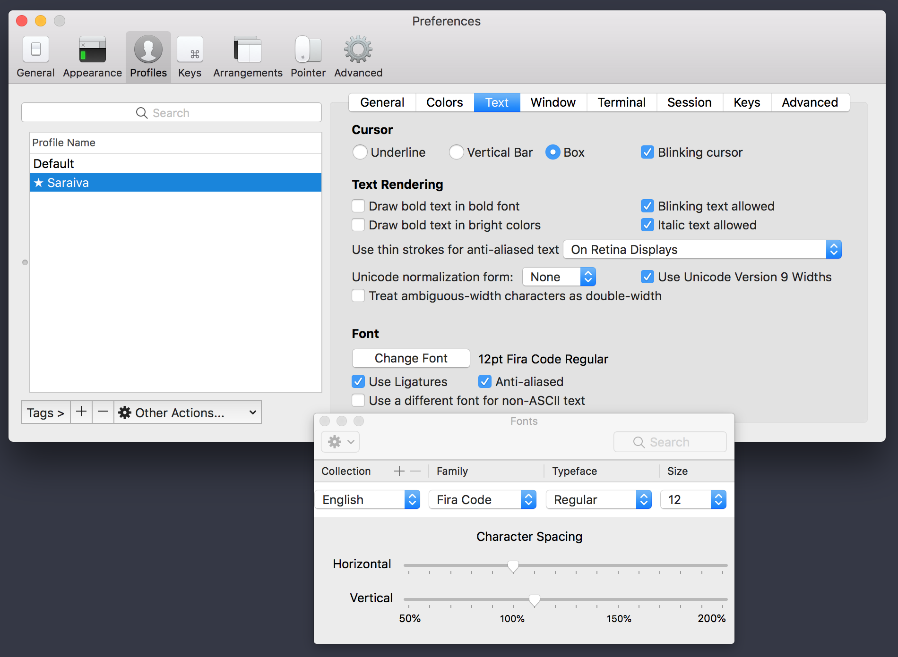

# Saraiva Theme

## Install font

Fira Code ([Get here](https://github.com/tonsky/FiraCode))

## Oh-my-zsh theme

### Install oh-my-zsh

via curl

```
sh -c "$(curl -fsSL https://raw.githubusercontent.com/robbyrussell/oh-my-zsh/master/tools/install.sh)"
```

via wget

```
sh -c "$(wget https://raw.githubusercontent.com/robbyrussell/oh-my-zsh/master/tools/install.sh -O -)"
```

### Install zsh-syntax-highlighting

```
$ brew install zsh-syntax-highlighting
```


### Copy zsh theme

Copy `saraiva.zsh-theme` to `~/.oh-my-zsh/themes/` folder

### Copy zsh config

Update your `~/.zshrc` file with the config in the `zshrc-config` file

## Terminal.app

Import `Saraiva.terminal` file into profiles settings and make it default


## iTerm

Import `Saraiva.itermcolors` file into your default profile color settings


Change font to Fira Code Regular 12pt


